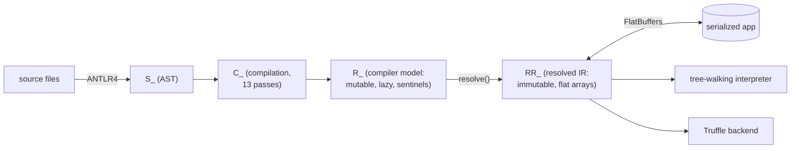
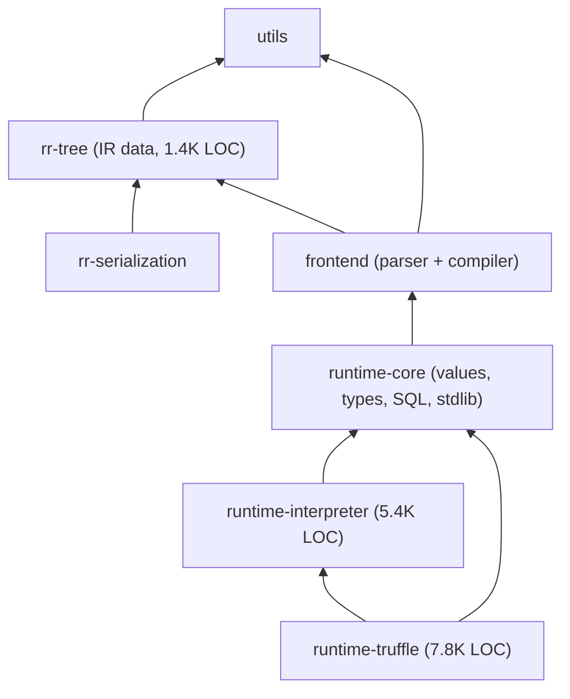
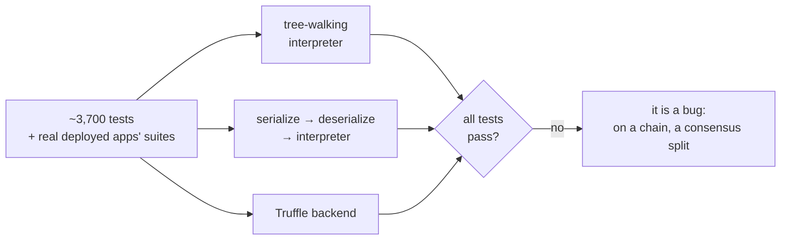

# Rewriting a production compiler's IR with AI agents in five weeks

Every language that survives long enough ends up rewriting the guts of its
compiler. C# did it with Roslyn. Rust grew MIR. Kotlin spent years on the
K2 transition, one I participated in from inside JetBrains' Kotlin team,
where I remember the new JVM backend still calling into the *old* backend
for the hardest parts, because nobody dared rewrite the inliner. The
pattern is always the same: a language is born with prototype-quality
internals, and then requirements arrive — a second backend, real IDE
support, serialization — that the original trees were never designed to
carry. For big languages, this rewrite is a multi-year, multi-team effort.

This spring I did that rewrite for [Rell](https://gitlab.com/chromaway/rell),
the smart-contract language of the Chromia blockchain, in five weeks,
directing AI agents. This post is about the part the agents could not do:
the design decision. And about the part I would not have done without
them.

## The setup

Rell is a standalone statically typed language with Kotlin-like syntax,
whose relational operations compile to SQL. A taste, runnable in the
[playground](https://chromiaproject.github.io/rell-playground/)'s
SQL dry-run pane:

```rell
entity user {
    key name: text;
    mutable age: integer;
}

entity post {
    key id: integer;
    index author: user;
    body: text;
}

// Each @-expression compiles to its own SELECT.
query main() {
    // Filter + sort + projection.
    val adults = user @* { .age >= 18 } ( @sort .name, .age );

    // Aggregate: count per author (GROUP BY).
    val post_counts = post @* {} ( @group .author.name, @sum 1 );

    return (adults = adults, post_counts = post_counts);
}
```

Those are @-expressions, Rell's query syntax. The two in
`main()` come out as:

```sql
select A00."name", A00."age" from "c0.user" A00
  where A00."age" >= ? order by A00."name", A00."rowid"

select A01."name", COALESCE(SUM(?),0) from "c0.post" A00
  join "c0.user" A01 on A00."author" = A01."rowid"
  group by A01."name" order by A01."name"
```

Note what the second one did: `.author.name` walked an entity reference,
and the join fell out of the compiler. I have maintained Rell solo since
February 2026; real blockchain networks run on every release. Rell is a
niche language, with a smaller blast radius than Rust or Kotlin, and
much simpler than either. I would still have budgeted most of a year for
this project by hand: untangling the old trees node by node, rewriting
the interpreter, keeping both worlds running mid-migration.

Two trades place Rell, and both are deliberate. The fastest chains
compute orders of magnitude faster than Chromia, and give the
application no database: no indexing of its own transactions, no
relational queries, so that work moves off-chain and gets paid for
twice. Rell buys the database and pays in throughput. The same trade
runs through language implementations. LLVM spends a lot of compile time
and emits fast code, which is the deal Julia takes: the first call to a
function pays for compiling it, and the code that comes out runs at C
speed. CPython spends none and executes slowly. The JVM, V8 and .NET sit
in between, compiling as they go. A tree-walking interpreter, which is
what Rell had, sits at the CPython end: it starts instantly and then
runs about as slowly as you would expect from walking a tree per
operation.

That is the gap Truffle closes, and it is why the second backend was
worth a rewrite. Truffle is a framework on GraalVM (an extended Java VM)
that takes an interpreter written to its conventions and lets the JIT
compiler specialize it to the program being run. The alternative for the
same speedup is emitting JVM bytecode from the compiler, which is a much
larger and more delicate thing to own. I wanted the backend built on
Truffle, and the compiler's output model could not support one. It also
could not support something I wanted more: serialization.

## The problem: execution logic lived on the compiler's tree

Before the rewrite, the compiler's output model (`R_App`) was mutable,
lazy, full of compiler-internal sentinels. Every node carried its own
execution, as an abstract `evaluate(frame)` on `R_Expr`. SQL generation
machinery (`SqlGenContext`, `SqlBuilder`) lived inside the *model*
package, on the same classes the compiler built. @-expressions mixed IR
nodes with runtime evaluator classes in one file. The runtime was tied
to the compiler the way it is in every language still running on its
original internals: not by a bad decision, but by a thousand convenient
ones.

The consequences: no second backend (execution was hard-wired into one
tree walk), no serialization (you cannot serialize behavior), and every
node in a blockchain network re-parses and re-compiles every app from
source, forever.

## The decision: how radically to detach?

This is where most of my effort went: not typing, one question. Two
options.

The conservative option is the K2 move I remembered from JetBrains: build
a new IR, and let it call into the old execution code in the hard places.
It is the rational choice for a team that cannot afford to rewrite
everything, and it is how large migrations actually ship. It is also a
compromise you live with for years.

The radical option: make the IR pure data (no behavior on nodes at all)
and re-assemble every scattered piece of interpretation as new, exhaustive
matching over the new tree. Including the database semantics:
@-expressions, SQL generation, create/update/delete.

I chose the radical option, and the serialization goal is what settled
it. A node that delegates to compiler-side code has nothing to write
into a language-neutral binary format: the delegation is JVM code, and
code is exactly what the format cannot carry. The hybrid was not just
worse; it had no representation. A hard external requirement is worth a
lot here: it converts a taste argument into a constraint.

The shape that came out: after all compiler passes, one resolution step
that, quoting the architecture doc shipped with it, "forces every
lazy field, drops compiler and IDE baggage, and replaces live object
references with integer indices into flat arrays," producing an immutable,
self-contained IR that serializes to FlatBuffers (a binary serialization
format) and is the *only* thing the runtime consumes. In the codebase it is called the RR tree.



The mechanics, briefly. IR nodes are sum types with a closed set of
variants — 39 expression, 17 statement, 16 database-expression — and the
interpreter is pattern matching over them that the compiler checks for
exhaustiveness, with per-domain logic split into separate files. In the
Kotlin below, a `sealed interface` is a sum type whose variants are all
declared in one file and known to the compiler, a `data class` is a
record with structural equality, and `when (expr) { is X -> ... }` is
the match over them: leave a variant out and the code does not compile.
The same node before and after, lightly trimmed from the repo:

```kotlin
// before: execution lives on the compiler's node
class R_IfExpr(
    type: R_Type,          // compiler type object, drags the compiler in
    private val cond: R_Expr,
    private val trueExpr: R_Expr,
    private val falseExpr: R_Expr,
): R_BaseExpr(type) {
    override fun evaluate0(frame: Rt_CallFrame): Rt_Value {
        val b = cond.evaluate(frame).asBoolean()
        return (if (b) trueExpr else falseExpr).evaluate(frame)
    }
}

// after: the node is data...
sealed interface RR_Expr {
    val type: RR_Type

    data class If(
        override val type: RR_Type,   // plain data, no compiler references
        val cond: RR_Expr,
        val trueExpr: RR_Expr,
        val falseExpr: RR_Expr,
    ): RR_Expr

    // ...
}

// ...and the interpreter owns the behavior, one arm per variant
fun evaluateExpr(expr: RR_Expr, frame: Rt_CallFrame): Rt_Value = when (expr) {
    is RR_Expr.If -> {
        val cond = (evaluateExpr(expr.cond, frame) as Rt_BooleanValue).value
        evaluateExpr(if (cond) expr.trueExpr else expr.falseExpr, frame)
    }
    // ...38 more arms; the compiler rejects a missing one
}
```

Cross-references are integer indices into flat per-kind arrays
(entities, structs, functions, queries…); serialized modules carry only
index vectors, and convenience maps are rebuilt on deserialization. The
resolver that builds all this is the only code allowed to force the
compiler's lazy fields; after it runs, nothing touches compiler types
again. The public compile entry point returns the RR tree rather than
the compiler model, so the boundary is also the library's API surface.

The compiler/runtime boundary is enforced by the build system's module
*dependency* graph (arrows read "depends on"):



Two honest notes on that graph. `runtime-core` still depends on the
frontend module ("for now", says the architecture doc), and most of that
dependency is the standard library: stdlib functions are declared
through the compiler's library framework, so their implementations still
handle compiler-model types. The execution modules are the clean ones;
the interpreter imports nothing from the frontend. The hard module split
itself landed two weeks after the main commit. And `rr-serialization`
has *no* production consumer inside the repo: a client that only wants
to load compiled programs needs `rr-tree` plus `rr-serialization` and
nothing else: no parser, no compiler.

## What it cost, from git

The main commit landed on April 21: 641 files, +32,050/−16,450. Rename
detection tells the honest story of new versus moved. The value types,
the runtime contexts and the database-driver plumbing are recognized as
moves. The interpreter is not: about 4,700 lines of dispatch, including
all the database semantics, written new over the RR tree. Around the
main commit: deserialization hardening April 24, the GraalVM Truffle
backend May 4 (+6,437), its specialization work May 8, test wiring May
21. About 17K lines of new Kotlin across three new modules.

What the diff actually bought is the structure every compiler textbook
draws and few languages have before their first internals rewrite: a
frontend that turns source into a description of the algorithm, and a
backend that consumes that description to run it or to translate it
further. Before, there was no such seam. `evaluate` on the model class
was the backend. Now the frontend ends at `resolve()`, and everything
downstream, tree-walker, Truffle, a future consumer in another language,
is a backend reading the same data.

Rewriting the database semantics is the part I would not have dared
alone. With agents doing the mechanical half, daring became affordable.
Without them, Rell would have gotten the new-IR-calls-old-code
compromise.

One detail matters beyond this project. The work was done with Claude
Opus 4.6, a model generation older and weaker than the agents that later
rewrote Bun. The architectural rewrite did not wait for a stronger model.
The limiting factor was the design and the verification, not the model
generation.

## What serialization buys, and how it is verified

Today every node re-parses and re-compiles each Rell app from source.
With serialized RR in the chain configuration (the shared settings every
node of a network runs from), a node could execute
compiled programs directly through a thin runtime: no parser, no
frontend, less code and startup work per node.
For that to be safe, executing the serialized form must be provably
indistinguishable from compiling from source. On a blockchain, any
difference is a consensus split: nodes compute different results and
stop agreeing on the chain's state. That is what the round-trip
invariant states:

```
interpret(compile(x)) ≡ interpret(deserialize(serialize(compile(x))))
```

It is enforced by re-running the full test suite (~3,700 tests) through a
serialize/deserialize pass. Together with the Truffle backend this makes
a **three-backend differential**: the same suite runs under the
tree-walking interpreter, the round-trip interpreter, and Truffle, and
the bar is that every test passes under all three.



The Truffle pass runs in CI on GraalVM, with a guard test that exists only to
prevent a silent fallback to the tree-walker from voiding the
differential. The round-trip pass runs automatically
in CI when a change touches the IR or the serialization layer, and can
be triggered manually on any other pipeline.

The differential's job is not to warn that a design change is coming;
that part is usually obvious. It is to prove the change landed
everywhere. In July, Rell gained value blocks (blocks usable as
expression arms, yielding a value) and jump expressions, and it was
clear from the feature design that both backends would have to recognize
the new control flow. An expression-shaped `execute` has no status slot
to return, so control flow moved to stackless exception escapes,
Truffle's conventional design. This reversed an earlier, equally
deliberate move to integer status codes, made when profiles of workloads
with many small calls showed exception handling dominating rule
evaluation. The new features made an exception channel necessary anyway;
quoting the design note in the source, "one conventional mechanism for
all control flow beats two coexisting ones." The flip was right. Its
reach was one boundary short: the standard-library call boundary still
handled escapes the old way, so the new features worked in the
tree-walking interpreter and crashed under Truffle, which has its own
control-flow exception family. Running the suite across backends
surfaced it at the desk, the boundary now converts between the two
families, and the regression tests for it run across all three backends.
A single-backend suite would have left the mismatch for someone else to
find.

The other half of "safe to execute serialized code" is the
deserialization security analysis, committed next to the schema. The
question it answers: can a crafted, serialized program binary do more
than Rell source code could? The answer is a mitigation table, not a
promise — allocation caps, integer wrap-around checks, duplicate mount
names (the names that map definitions to SQL tables) treated as a
consensus-divergence risk, a recursion guard, and a
build-time SHA-256 over the schema files, verified on every deserialize.
A fuzz test runs 2,000 deterministic inputs plus byte-flip and truncation
sweeps on every build; deserialization either succeeds or fails with a
typed error, never a VM-fatal crash.

One honest caveat: thin-runtime nodes are not deployed. Shipping
serialized RR into chain configurations has not been green-lit, so
production still compiles from source. There is no hard technical barrier
left: the serialization, the hardening and the invariant are built and
tested ahead of that decision, which is the right order to build them in.

## The Truffle backend, with numbers

The Truffle backend ships behind an opt-in runtime flag and is loaded by
class name at run time, so it sits in the distribution without being
wired in: full test parity, deliberately not the default. It is a peer
backend in the strict sense: same runtime values, same standard library, same database
connection; only the dispatch differs. The repo's own rule for it is one
sentence: "Differences between the tree-walker and Truffle are Truffle
bugs."

The reason a solo maintainer can own a JIT backend at all is what the
code looks like. Take the same `if` expression from earlier. Emitting
JVM bytecode for it, the classic way to make a JVM language fast, means
writing something in this register:

```java
// the path not taken: hand-emitting bytecode
Label elseBranch = new Label(), end = new Label();
compile(cond, mv);                       // leaves a boolean on the stack
mv.visitJumpInsn(IFEQ, elseBranch);
compile(trueExpr, mv);
mv.visitJumpInsn(GOTO, end);
mv.visitLabel(elseBranch);
mv.visitFrame(F_SAME, 0, null, 0, null); // stack map, or the verifier rejects it
compile(falseExpr, mv);
mv.visitLabel(end);
mv.visitFrame(F_SAME, 0, null, 0, null);
```

You are now maintaining stack maps, local-variable slots and verifier
rules, and a mistake surfaces as a
[`VerifyError`](https://docs.oracle.com/en/java/javase/21/docs/api/java.base/java/lang/VerifyError.html)
at class-load time
rather than a wrong answer you can debug. The Truffle version of the
same node, trimmed from the repo, is the interpreter you would have
written anyway:

```kotlin
internal class Generic(
    @field:Child private var cond: Tf_ExprNode,
    @field:Child private var trueBranch: Tf_ExprNode,
    @field:Child private var falseBranch: Tf_ExprNode,
): Tf_IfExprNode() {
    override fun execute(frame: VirtualFrame): Rt_Value =
        if (cond.executeBoolean(frame)) trueBranch.execute(frame)
        else falseBranch.execute(frame)
}
```

One JVM fact makes the rest of this section legible. The JVM splits
values into primitives, which live in registers and on the stack, and
objects, which are allocated on the heap. An interpreter that hands
around one generic value type boxes every intermediate result into an
object, so a loop that adds integers allocates on every iteration. That
is what `executeBoolean` above avoids: the typed path returns a raw
boolean instead of wrapping it.

The
[`@Child`](https://www.graalvm.org/truffle/javadoc/com/oracle/truffle/api/nodes/Node.Child.html)
annotations and the
[`VirtualFrame`](https://www.graalvm.org/truffle/javadoc/com/oracle/truffle/api/frame/VirtualFrame.html)
are the whole contract: they tell Graal the tree shape is stable, so
partial evaluation can compile this method against *one* program's nodes
and constant-fold the dispatch away. This is the first Futamura
projection, done for real and in production: specialize an interpreter
to a fixed program and what falls out is a compiler for it. What is left
reads like the tree-walker. That is the deal Truffle offers:
interpreter-shaped source, compiled-language speed, and the machinery
that gets you there is not yours to maintain.

How much it buys depends on the workload shape, and the honest way to
show that is the [per-commit benchmark report from
CI](https://chromaway.gitlab.io/-/rell/-/jobs/15761948926/artifacts/public/report.html)
(run with JMH, the standard JVM benchmark harness, on GraalVM 21; 73
benchmarks across 7 suites; a public CI artifact, not my laptop).
The harness matters because JVM code starts out interpreted and is
compiled only after the JIT has watched it run, so the first iterations
of anything measure the wrong thing; JMH warms each benchmark up and
reports the steady state.
A summary, all values average ms per operation, lower is better:

| workload shape | tree-walker | Truffle | note |
|---|---|---|---|
| compute-bound loop (primes, Collatz, Fibonacci) | 763.6 | 23.2 | hand-written Kotlin: 12.9 |
| real library code (FT4, a Rell asset library) | — | ×1.3–1.6 faster | serialization, rule evaluation |
| struct/DTO mapping | — | ×2.4–4.5 faster | |
| decimal-heavy numeric code | — | ×1.1–1.2 faster | ≥60% of time is JDK BigDecimal: no dispatch to win |
| Advent-of-Code corpus (14 samples) | median ×39 slower than Kotlin | median ×28 slower than Kotlin | 2 of 14 samples: tree-walker beats Truffle |

The pattern is the classic one. Where the tree-walker's dispatch
overhead dominates, partial evaluation removes it: on the compute-bound
suite, Truffle cuts 763.6ms to 23.2ms, a 33x drop.

**The 1.8x that remains against hand-written Kotlin is the number worth
reading, because of what it is measured against. Kotlin here is
optimized JVM bytecode, which is the output a run-time bytecode
generator would be trying to match, so that path sets the ceiling at 1x.
Truffle comes within a factor of two of the ceiling while the source
stays an interpreter: interpretation overhead went from 33x to under 2x,
and the labels, stack maps and verifier rules from earlier never got
written.**

Where the JDK's
[`BigDecimal`](https://docs.oracle.com/en/java/javase/21/docs/api/java.base/java/math/BigDecimal.html)
(Java's arbitrary-precision decimal type) dominates, the dispatch was
never the cost, and specializing it wins nothing. The fix there was
different: decimal fast-path leaves that keep values in `long` when they
fit, which the report credits on a simplex-noise benchmark. And on two
small samples the tree-walker still wins outright. Benchmarks that only
bragged would not have told me any of that.

## Optimizing against a compiler you did not write

Graal's internals are not the interesting part here, and you do not need
them: what a backend author works with is partial evaluation as a
contract, plus a profiler. The loop was to run the benchmark suites with
async-profiler attached, and feed both, the numbers and the profiles of
the benchmarks themselves, to the agent, asking for ideas ranked by
return. One such prompt, verbatim: "Analyze profiling data and tell only
the most profitable Rell-sided directions to make nodes faster. Judge by
return, not by engineering effort." The agent proposes; the ranking and
the risk policy are mine.

The policy was tiered. First I greenlit changes that improve the code
whether or not they help performance. The main example is removing
fallbacks from the Truffle backend to the plain interpreter: each one
deleted is a performance win and one less coupling between the two
modules. It cuts the other way for correctness, and that is worth being
precise about. A fallback cannot disagree with the interpreter, because
it *is* the interpreter; deleting it creates a second implementation
that can. Trading a guaranteed-identical slow path for an independent
fast one is only sane if something checks the two against each other,
which is the differential's whole job. Second came changes that add code
but are logical and system-independent, such as keeping a number in a
`long` (or a custom 128-bit integer) when it fits instead of allocating
a
[`BigInteger`](https://docs.oracle.com/en/java/javase/21/docs/api/java.base/java/math/BigInteger.html);
the decimal fast-path representations in the benchmark table above are
this tier, and they live in the tree as ordinary, readable wrapper
types. Machine-dependent tricks would come last, and mostly did not come
at all.

The same policy also kills work, including work already done. The
GraalVM bytecode DSL (a Truffle facility that generates a bytecode
interpreter in place of a tree walker) got the full treatment: built
into the backend, benchmarked, profiled, and reverted, because profiling
never showed the bytecode path hot, and keeping it meant carrying a
Java-shaped rewrite for an unproven benefit. The revert was scoped with
care: the struct optimization borrowed from SOM (a research Smalltalk
VM) came from the same chain of refactors, *did* pay off in benchmarks,
and stayed. Buying the option, measuring it, and killing it is more
expensive than not building it, and much cheaper at agent prices than it
used to be.

The estimates are a sorting key, not a truth. The benchmark suite is
the truth.

## Takeaways

1. **With agents, skip the bridge.** The standard playbook for IR
   migrations is incremental: keep old and new running side by side,
   migrate consumers one by one, live with adapters for years. That
   playbook exists because human bandwidth makes the migration window
   long. Agents shrink the window to weeks, and at that length the
   adapters and dual paths cost more than they buy. Decide the end state,
   cut over in one reviewed move, and spend the saved effort on the
   harness that proves the cutover.
2. **A serialization requirement is a forcing function.** It rules out
   the half-measures before they are written, which is stronger than
   testing them out afterwards: whatever the backend needs has to be
   expressible as plain data in a language-neutral schema, and a call
   back into the compiler is not. The round-trip suite is the weaker,
   second line; it only exercises what the tests reach. If you want a
   clean boundary, pick a constraint that leaves the unclean options
   unrepresentable, and let the suite police the residue.
3. **Agents change which options are affordable.** The radical rewrite
   was always the better design; it was never the rational choice for one
   person until the mechanical half became cheap. Re-check old
   design decisions against the new cost of labor: some of them were
   compromises with a budget, not with reality.

---

*Everything referenced is public:
[rell](https://github.com/chromiaproject/rell) (the architecture doc and
the serialization security analysis are in the repo), and the
[playground](https://chromiaproject.github.io/rell-playground/), which
runs this compiler in your browser.*
