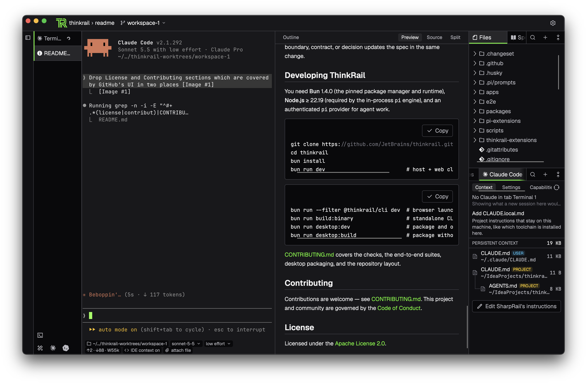
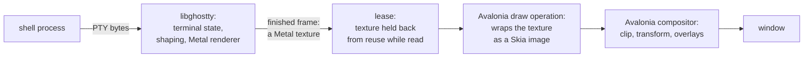

# I ported Thinkrail's workbench from a WebView to Avalonia with Ghostty

Shopify [wrote in September](https://shopify.engineering/back-to-native) that it is moving from React Native back to Swift and Kotlin, because with coding agents "building the same feature in Swift and Kotlin no longer carries the cost it used to". For a desktop app that road means SwiftUI, WinUI and GTK, and then checking every screen on every system. Writing the code several times got cheap. Testing it several times did not.

This article is about [SharpRail](https://github.com/CommanderTvis/sharprail), a desktop app I rewrote on [Avalonia](https://avaloniaui.net/), a .NET toolkit that draws its own UI. Its terminal is Ghostty and its editor is Scintilla. I now work in it every day.

## The fork: extending Thinkrail

[Thinkrail](https://github.com/JetBrains/thinkrail) is JetBrains' open-source desktop client for the [pi](https://www.npmjs.com/package/@earendil-works/pi-coding-agent) coding agent. It is a React application in the system WebView, with a Bun host process behind it.

I [forked](https://github.com/CommanderTvis/thinkrail) it because I work with Claude Code and Codex. The fork runs them in its terminals and adds what they need around them: a configuration pane, hooks, a bridge to the editor. To keep such integrations out of the core I added a plugin API. Plugins are loaded into the running app and add their own panels, and the Claude Code and Codex support are now plugins themselves.

All of this is added on top of Thinkrail's code. The React UI, the WebView and the Bun host are the original ones.

## The rewrite: SharpRail

SharpRail is a second project with a new codebase. It shares no code with Thinkrail or the fork. From Thinkrail it takes the look of the UI, and from the fork the feature list.

I like the UI of Thinkrail and got annoyed with the WebView under it. So the requirements for a replacement were:

1. Static typing and an open world, with a very light runtime.
2. Reusable UI components, so that I do not test every small thing on three computers. Native GPU-accelerated views must be embeddable in the window.
3. A GPU-accelerated terminal and editor.
4. Startup time and memory at the level of [Zed](https://zed.dev).

"Open world" means code can be loaded after the build. That rules out Rust, Dart AOT and C#'s [Native AOT](https://learn.microsoft.com/en-us/dotnet/core/deploying/native-aot/) for a plugin host. Zed's extensions are WebAssembly with a host API that [cannot add UI](https://zed.dev/blog/zed-decoded-extensions).

### Why not Rust?

A Rust program can load a shared library at run time. Two things follow. A plugin is then native code, so its author ships one binary per operating system and CPU architecture, either all in one archive or through a repository that serves the right one. And everything a class loader does, I would write from scratch. A .NET plugin is one assembly for every platform, and the runtime loads it.

## Choosing the stack

Agents then built the application twice.

| | React Native prototype | Avalonia prototype |
| --- | --- | --- |
| UI | AppKit views through [react-native-macos](https://github.com/microsoft/react-native-macos) | [Skia](https://skia.org), drawn by Avalonia |
| Host | Thinkrail's Bun host, unchanged | rewritten in C#, in-process |
| Scope | projects, workspaces, chats, files, diffs, specs, most settings; plain-text editor and terminal | tabs, docking, settings, Markdown preview, Git changes, worktrees |
| Platforms it ran on | macOS | macOS |
| Source | [`apps/native`](https://github.com/CommanderTvis/thinkrail/tree/bfa68eb6a3954b19f5e40598a3656520dc4ec149/apps/native) | [sharprail](https://github.com/CommanderTvis/sharprail) |

Both were measured against JetBrains' Thinkrail, Zed and [JetBrains Air](https://blog.jetbrains.com/air/2026/03/air-launches-as-public-preview-a-new-wave-of-dev-tooling-built-on-26-years-of-experience/): ten cold launches each, time to first window, time to a laid-out workspace, memory.

These are runs on one Apple M4 Pro. The [report](https://github.com/CommanderTvis/thinkrail/blob/bfa68eb6a3954b19f5e40598a3656520dc4ec149/apps/native/BENCHMARK.md) defines each column. SharpRail appears twice: with the C# host inside the UI process, and with the host as a separate process. Neither row starts the Pi agent host, so their workload is lighter than the first two. In Thinkrail the window is created only after the Bun host has booted, so the host accounts for most of the time to the first window.

### Why not React Native if it's so good?

React Native did better than Avalonia on memory and on time to the first window. It lost on Linux. Microsoft maintains the [macOS and Windows ports](https://reactnative.dev/docs/out-of-tree-platforms). Linux has been tried several times:

- [react-native-desktop-qt](https://github.com/status-im/react-native-desktop-qt): support stopped, last commit in 2021
- [React Native Skia](https://github.com/react-native-skia/react-native-skia): last commit in 2023
- [lucid-softworks/react-native-linux](https://github.com/lucid-softworks/react-native-linux): last commit in July 2026
- [react-native-gtkx](https://github.com/itsmepetrov/react-native-gtkx): last commit in August 2026
- [react-native-linux](https://github.com/react-native-linux/react-native-linux): active, pre-alpha, one maintainer

The fallback would be react-native-web in a WebView.

### Why not Compose on the JVM?

I wanted precompiled code at startup and a way to load plugin code later. The JVM has several routes to that, and none of them is usable for a desktop app today:

- [JEP 544](https://openjdk.org/jeps/544) puts compiled code into HotSpot's AOT cache. It is targeted to JDK 28.
- [Project Crema](https://github.com/oracle/graal/issues/11327) adds class loading to [GraalVM](https://www.graalvm.org/) native images. It is in development. [Compose](https://kotlinlang.org/compose-multiplatform/) needs AWT, which BellSoft's [Liberica Native Image Kit](https://bell-sw.com/liberica-native-image-kit/) supports, so a hypothetical Liberica build with Crema would have covered my case.
- [CRaC](https://docs.azul.com/core/crac/crac-introduction) restores a warmed-up JVM from a snapshot. It is fully supported on Linux only, and I know of no desktop app that uses it.

### What .NET has today

.NET has shipped precompiled code with a JIT still present since Core 3.0, as [ReadyToRun](https://learn.microsoft.com/en-us/dotnet/core/deploying/ready-to-run): native code next to IL in each assembly, and a JIT that recompiles hot methods and compiles whatever is loaded later.

## Claude's favorite UI framework

Both stacks I prototyped came from humans. React Native was my idea. A friend suggested Avalonia, which I already knew. The agent I discussed the rewrite with left Avalonia out of its comparison. To check, I gave Claude Code [500 prompts](framework-defaults/README.md) that ask for a desktop app and name no language or framework: 100 app ideas in five phrasings, each in a fresh session with my configuration switched off. The stack is read from the files the agent writes.

| Prompt adds | Electron | [Tauri](https://tauri.app) | [Tkinter](https://docs.python.org/3/library/tkinter.html) | [egui](https://www.egui.rs/) | SwiftUI | HTML file or script | Other |
| --- | ---: | ---: | ---: | ---: | ---: | ---: | ---: |
| nothing | 57 | 0 | 43 | 0 | 0 | 0 | 0 |
| "Windows, macOS and Linux" | 63 | 0 | 35 | 0 | 0 | 0 | 2 |
| "start fast and use little memory" | 0 | 11 | 43 | 22 | 23 | 0 | 1 |
| both | 0 | 40 | 3 | 54 | 0 | 0 | 3 |
| "I'm not a programmer" | 0 | 0 | 11 | 0 | 2 | 86 | 1 |

Each row is 100 runs. By default the answer is Electron or Tkinter. Asking for speed replaces Electron with Tauri and egui. [Flutter](https://flutter.dev), Compose and Avalonia never appear.

## Ghostty inside an Avalonia window

The terminal is [libghostty](https://github.com/ghostty-org/ghostty). It comes with its own macOS view, an `NSView`, and the direct way to embed it is to put that view into the window.

That runs into a problem every self-drawing toolkit has. Avalonia draws everything in its window into one surface. A native view is a separate layer, and the system puts it on top of that surface. Whatever Avalonia draws in the same rectangle, a menu, a popup, a drag preview, ends up underneath the terminal. This is known as the airspace problem. The path below exists for this one reason.

Ghostty has no API for handing its frames to another renderer, and it reuses its textures from frame to frame. So I [patched](https://github.com/CommanderTvis/sharprail/blob/d0a31147710ddc4e8057c6ef7a719ad724088b52/src/Ghostty.Avalonia/README.md#L101-L113) the Ghostty version SharpRail builds against. The patch gives Avalonia the texture of the last finished frame, and Ghostty does not draw into that texture again until Avalonia has read it. That hold is the lease in the diagram. Avalonia reads the texture where it is, with no CPU copy and no second texture. A second patch fixes a leak in Ghostty's scrollback page recycling.

The extra step costs some latency and CPU on redraw, and it is [measured](https://github.com/CommanderTvis/sharprail/blob/d0a31147710ddc4e8057c6ef7a719ad724088b52/benchmarks/ghostty/README.md). This cost is small. Avalonia itself costs much more: in the charts above, the React Native prototype uses native views, shows its first window sooner and takes about half the memory.

Without Metal, a second control draws the terminal with Skia from the cell grid of libghostty-vt, the terminal-state part of Ghostty without a renderer. It has no image protocols and no ligatures across cells. Its design comes from [RoyalTerminal](https://github.com/royalapplications/RoyalTerminal).

Thinkrail's terminal is [xterm.js](https://xtermjs.org/). xterm.js can draw on the GPU through an optional WebGL module. Thinkrail's authors left it off and draw the terminal with HTML elements. They [wrote down why](https://github.com/JetBrains/thinkrail/blob/3822748ba86a365d776c4db73af341f822d064dc/architecture.md#L203-L207): the module does not release its GPU resources when a terminal is closed, and Thinkrail opens and closes terminals often.

Also, in Thinkrail every keystroke in a terminal is [a request](https://github.com/JetBrains/thinkrail/blob/3822748ba86a365d776c4db73af341f822d064dc/apps/web/src/panels/TerminalInstance.tsx#L219-L221) from the page to the Bun host over [a WebSocket](https://github.com/JetBrains/thinkrail/blob/3822748ba86a365d776c4db73af341f822d064dc/apps/web/src/transport/transport.ts#L84), and output returns the same way. I have not measured what that costs. In SharpRail a local terminal [talks to its shell in process](https://github.com/CommanderTvis/sharprail/commit/e561421f1c3312c4c9af895762c62c774cff30a7), with no socket in between.

## Scintilla drawn with Skia

The editor is [Scintilla](https://www.scintilla.org/), in place of Thinkrail's [Monaco](https://microsoft.github.io/monaco-editor/). Scintilla keeps the document, selections, undo and line wrapping. To run somewhere new, Scintilla needs two things from its host: keyboard and mouse events, and a set of drawing functions such as "draw this text here" and "how wide is this string". SharpRail provides both. The drawing functions are C++ stubs that call into C#, where Skia draws. The result is cached and redrawn only when the text changes.

[HarfBuzz](https://harfbuzz.github.io/) turns characters into glyphs, and [SheenBidi](https://github.com/Tehreer/SheenBidi) puts right-to-left text into visual order. Scintilla draws text in the order it is stored, so one [patch](https://github.com/CommanderTvis/sharprail/blob/d0a31147710ddc4e8057c6ef7a719ad724088b52/src/SharpRail.Scintilla/README.md#L44-L59) sends two of its drawing paths through this layout.

Not implemented: syntax lexers, completion, an accessibility text provider.

## Where it stands

- Everything is tested on macOS only. Porting to Windows and Linux is not hard, but SharpRail is at the prototype stage, even though I am writing this article in it. Avalonia draws the same pixels on every system, so the part that needs testing on each platform is the natively rendered Ghostty terminal.
- It uses more memory than the WebView app it replaces. Most of the difference arrived with the terminal: Ghostty's GPU renderer runs next to Avalonia's. I have not yet compared the same build with the terminal on and off.
- I have not measured typing latency, scrolling or frame time. By feel, xterm.js without its WebGL module is worse than Ghostty, and Ghostty is one of the terminals others get compared to.
- Nine plugins from the fork are ported, including Claude Code and Codex.
- Plugins run with the full rights of the app. A security model for them is a separate task that I have not started. My experiments are far from being merged into JetBrains' Thinkrail, so nobody else will write plugins for this runtime for now.

## Takeaways

I have done this once, on one project, so these are suggestions.

- Before choosing a UI stack for an existing application, ask an agent for a rough copy of it in each candidate. This took me two evenings and showed that most of the startup time was in the host process.
- Write down the requirements that rule candidates out before you benchmark. "Plugins load after the build" ruled out Rust, Dart AOT and C#'s Native AOT. "Linux" ruled out React Native.
